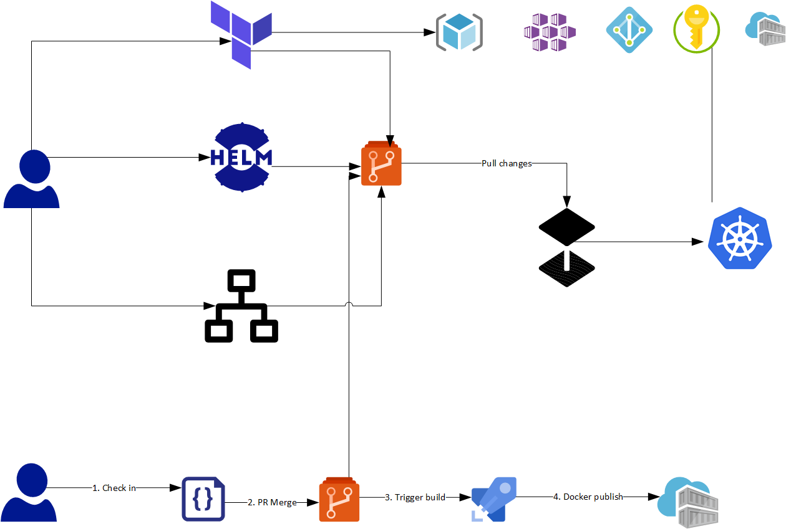

## CI/CD with gitops (flux), terraform, helm, fabrikate and bedrock

deployment artifacts can be grouped into 3 categories:
- azure resources: use terraform to sync states
- app code (services): use helm to push changes to aks
- k8s infra: use helm to push changes to k8s

building blocks:
- [fabrikate_definitions](https://github.com/smartpcr/fabrikate-definitions):
- [hdl](https://github.com/smartpcr/hdl): defines high level services and aks infra components
- [bedrock](https://github.com/smartpcr/bedrock): terraform modules
- bedrock-lab (this repo): bootstrap
- [git-deploy](https://github.com/smartpcr/git-deploy): generated yaml manifest to be synchronized into aks

## intro
Before git repo and aks cluster can be synchronized, the following must be created first
 - aks cluster
 - deploy flux to aks cluster
 - point flux to git repo

This project does just that, it creates a minimal aks cluster with flux component (based on bedrock)

In addition, the following modification are made to aks cluster:
1. aad integration (server and client app), so that aad user/group can login to dashboard
2. service principal was used for both aks cluster and terraform deployment, it can be authenticated by either password or certificate
3. a few add-ons are enabled: http-application-routing, monitoring, and dev-spaces
4. dashboard is granted cluster-admin role for non-prod (dev, int) cluster, and reader role for prod cluster
5. aad users and groups can be granted contributor/reader role in aks cluster
6. install helm/tiller

## steps
_note: execute scripts in mac or linux, there are some gliches with WSL_
1. modify `setting.yaml` file to point to your subscription, and where you want it to be created
2. run `bootstrap-aks.ps1`
3. navigate to terraform output folder, run `run-terraform.sh`

## progress

### Bootstrap
| order | task | status | comments |
| -- | -- | -- | -- |
| 1 | provision flux and aks cluster | done | |
| 2 | output admin kube config | done | |
| 3 | integrate aad profile | done | |
| 4 | additional addons (routing, monitoring, devspaces) | done | |
| 5 | grant dashboard access | done | |
| 6 | grant additional aad user and groups | done | |
| 7 | update deploy-key, repo-url in flux settings and enable sync | done | |
| 8 | enable remote tf state using azure blob storage | done | |
| 9 | dns zone | done | |
| 10 | cosmos-db | done | consistency level was using default values for `Session`, but validation failed, reapplaying takes > 10 min! |
| 11 | user assigned identity and required permissions | done | takes a long time till identity is propagated and available for role assignment |
| 12 | app-insights | done | |
| 13 | kv backup/master | done | enable soft delete, add delete lock, sync and pre-populate secrets/certs |
| 14 | acr backup/master | done | add delete lock, sync and pre-populate base docker images, infra images |
| 15 | acr | done | store docker-registry-json in kv |

### HDL for infra
| order | HDL component | status | notes |
| -- | -- | -- | -- |
| 1 | [key vault controller](https://github.com/SparebankenVest/azure-key-vault-to-kubernetes) | in-progress | sync secrets and certs from kv to k8s |
| 2 | aad-pod-identity | in-progress | need to bind service |
| 3 | nginx | done | dns zone (handled by azure terraform module) is pre-requirement |
| 4 | external-dns | validating | need imagePullSecrets, azure-config-file |
| 5 | linux-geneva | done | got AME card, provision service principal, grant access, store secrets |
| 6 | geneva-metrics | no | need provision new service principal to access geneva-linux acr |
| 7 | geneva-service | no | need provision new service principal to access geneva-linux acr |
| 8 | prometheus-grafana-alert-manager | done | need to deploy all resources to namespace 'prometheus' |
| 9 | fluentd-elasticsearch-kibana | done | |
| 10 | servicebus, kafka | no | |
| 11 | jaeger, app-insights | no | |

### HDL for services (helm)
| order | HDL component | status |
| -- | -- | -- |
| 1 | script to migrate to helm | in progress |
| 1 | prod-catalog-api | in-progress |
| 2 | prod-catalog-web | in-progress |
| 3 | prod-catalog-sync-job | in-progress |

### build script to translate HDL to yamls
| order | task | status |
| -- | -- | -- |
| 1 | ADO CI/CD pipeline | no |
| 2 | support ADO git repo | no |
